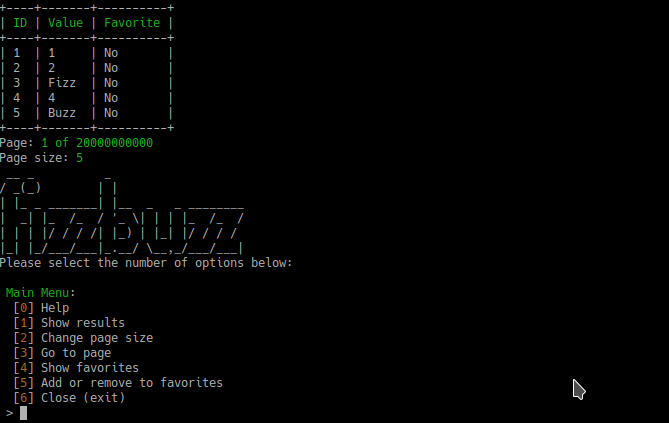

# Fizz Buzz Client

```
 __ _          _                   
/ _(_)        | |                  
| |_ _ _______| |__  _   _ ________
|  _| |_  /_  / '_ \| | | |_  /_  /
| | | |/ / / /| |_) | |_| |/ / / /
|_| |_/___/___|_.__/ \__,_/___/___|
```

**Requirements**

The following app is designed to be run  on a host with the following tools
- OS capable of running PHP 7.1.3+
- fizzbuzz-api package running on same machine in default settings (http://localhost:3000) please visit [https://github.com/lnesi/fizzbuzz-api](https://github.com/lnesi/fizzbuzz-api) for details.

**To run source also required:**

- composer [https://getcomposer.org/download/](https://getcomposer.org/download/)

**Required PHP Pacages:**
On Linux hosts the following packages (debian)
```
php-common                                      install
php-xdebug                                      install
php7.2-cli                                      install
php7.2-common                                   install
php7.2-intl                                     install
php7.2-json                                     install
php7.2-mbstring                                 install
php7.2-opcache                                  install
php7.2-readline                                 install
php7.2-xml                                      install
```

**Run build v0.1**

From builds folder. No installation or composer required

```
./fizzbuzz-client start
```
**Install for development or to run source**
```
composer install
```

**Run Source**
```
./fizzbuzz-client start
-- or --
php fizzbuzz-client start
```

**Build release**

From Root of project director
```
./fizzbuzz-client app:build
-- or --
php fizzbuzz-client app:build
```

This will generate a self executable php file inside the build folder.

##FizzBuzz Client Help



Select the oprations you desire to execute by introducing the action number in brakets on the menu.

**Navigation**

Yo can navigate the pagination by using Go to page [3] command and introducing page number, if page number is invalid the app will default back to page 1

**Favorites**

You can add or remove to favories by using option [5] and indicating the ID of the item you desire to save or remove.
If the item is not already added into the favorites will be added however if the item is alredy on the favorite list will be removed.

**Pagination**
You can specified the size of list to display by using option [2]. If the size is negative or out of bounds (100,000,000,000) will default to 100 which is the default value.
